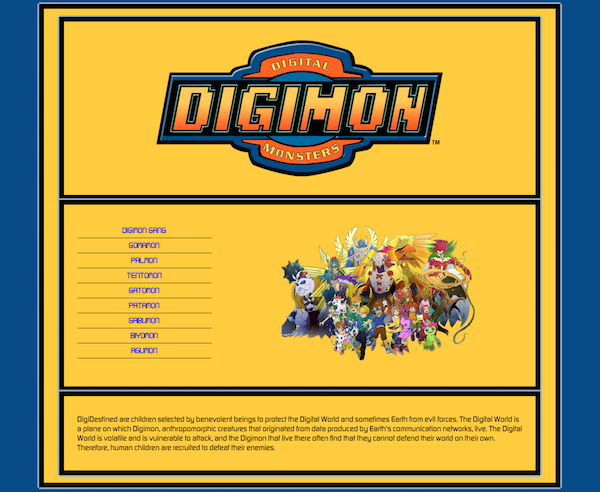
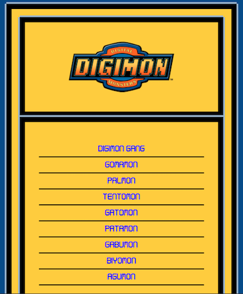
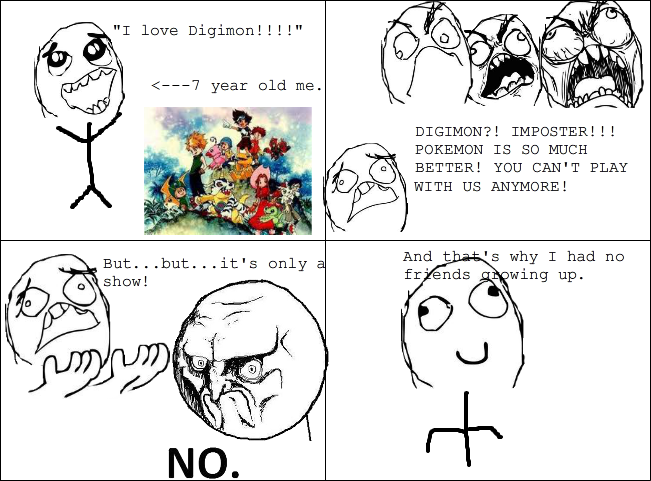

# ScssyDigimon

## *Some sassy little Digital Monsters just got their own web page...*

Check it out at [Scssy little Digimon]()

## TL;DR:

The idea behind this project was to demonstrate my understanding of [Sass/Scss](http://sass-lang.com/).

Scss is a CSS preprocessor. It is fantastic for responsive design and writing dry code thanks to its Mixins and Variables. As a result it is easier to read (once the basics are understood) and much easier to maintain than standard CSS.

This was my first full website built using SCSS. I got to grips with Scss variables and mixins and some rather clever responsive design. Throw in some applied [jQuery](https://jquery.com/) and [JSON](http://www.json.org/) objects for good measure, a lot of photoshop cropping and whalla! The [Digimon](http://digimon.wikia.com/wiki/Digimon_Adventure), and their Digidestined - Pokémon's long held rival, finally have a simple site to call their own!

Desktop View                                                            |  Mobile View
:-------------------------------------------------------------------------:|:----------------------------------------------------------------------:
 |  

## Why Digimon are better than Pokémon...

The idea behind this project was to teach myself how to use and understand CSS preprocessors. After some research, and since [Less](http://lesscss.org/) has fallen out of favour within the community, I concentrated my efforts on [Sass](http://sass-lang.com/), or more specifically __Scss__.

Scss is popular and commonly used in development, but can be challenging if the basics are misunderstood. This is why when choosing to build my web site in Scss, I deliberately stayed away from using any 'Sass frameworks' such as [Compass](http://compass-style.org/) or [Bourbon](http://bourbon.io/). I also chose Scss over the original Sass, because I felt it would help me read the code more clearly and maintain good habits when I go back to writing in CSS after my experiment.

And of course building this site meant I could further the Digimons cause...

## Tools

* SCSS
* HTML
* jQuery
* JSON

With thanks to [Kezz Bracey](http://tutsplus.com/authors/kezz-bracey)

## Mistakes made and learned from

Scss's use of Variables and Mixins reminded me of [Ruby](https://www.ruby-lang.org/en/) again, or rather back end languages. They made my style sheet look extremely dry and much easier to alter, but I did use them when they were not needed on occasion.

For example: by trying to create a bulletproof Font Mixin (like those used in Compass etc) I ended up making something that was rather big and simply not needed for my Site. Just using ```font-family``` correctly was enough, as my web page has only 2 font styles to choose from anyway. However should I ever increase the complexity of this page, and need more font options, it is good to know I can recreate a more complex Font Mixin again.

My favourite part of the learning curve was understanding the maths behind the Scss Mixin that generates the responsive design:
```scss
@media #{$breakpoint-medium} {
  .wrapper {
    width: 95%;
    max-width: $grid-max-width;
  }
  @for $x from 1 through $grid-columns {
    .column-#{$x} {
      width: 100% / $grid-columns * $x;
    }
  }
}
```
This led to a much easier design process.

I grossly underestimated the Photoshop part of the project. It took up a lot more time than expected considering all that was needed was a simple cut out of each character image - *easy to do, but took aaaages: cut, layer, crop, repeat, cut, layer, crop, repeat...*

I found that by trying to extract my JSON objects into their own separate file - which I was keen to do for the sake of directory cleanliness - leaned towards the unnecessary and led to a lot of complications, I so ended up keeping my JSON and jQuery code in the same script.

Getting any coherent images or information on my favourite childhood TV series was difficult. I truly am the only Digimon fan on the entire planet...

## Conclusion

Scss is amazing and makes for highly productive code, I would love to use it again in another project, possibly with a framework next time.


